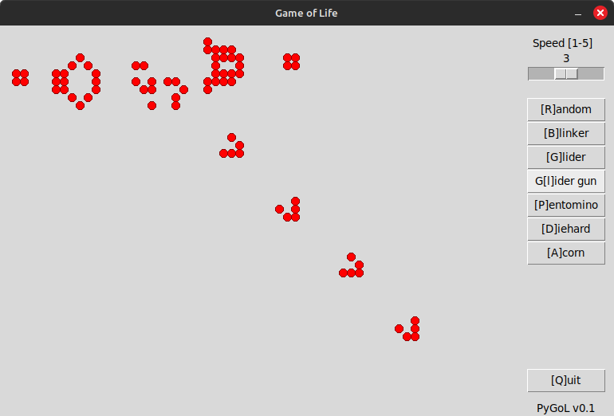
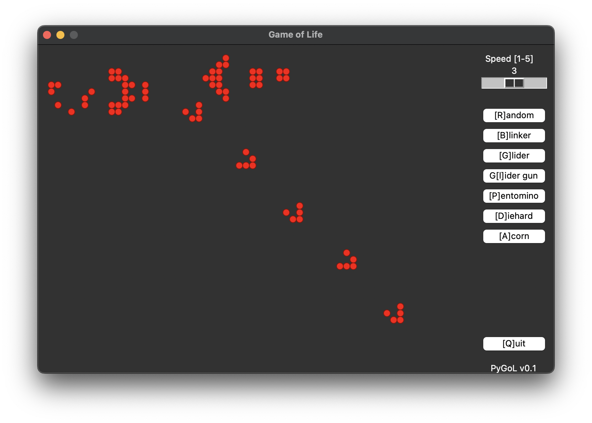

# PyGoL - Python Game of Life

A very basic python implementation for Conway's "Game of Life" using Tkinter for the GUI

[https://en.wikipedia.org/wiki/Conway%27s_Game_of_Life]

Running on Linux

Running on Mac

