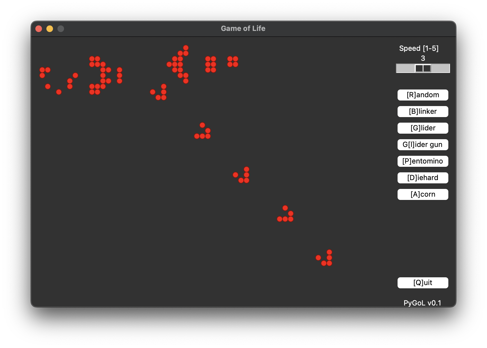

# PyGoL (Python Game of Life)

## Description

A very basic python implementation for Conway's "Game of Life".

## Screenshot

## Usage

Run via "./PyGoL.py".

## Background

The program uses Tkinter for the GUI. Therefore this should run on any basic Python Installation.

<https://en.wikipedia.org/wiki/Conway%27s_Game_of_Life>

## License

MIT License, see "License.txt".

## Author

By Martin Ochs
